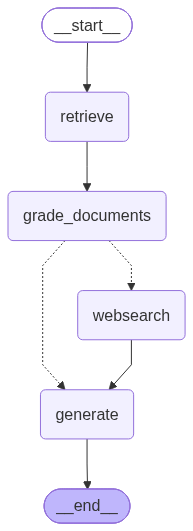

# Agentic RAG with LangGraph

A retrieval-augmented generation workflow built with LangGraph, LangChain, Azure OpenAI, and Tavily search. The graph follows a simple flow:

1. A user question is used to retrieve relevant documents from the local vector store.
2. Retrieved documents are graded for relevance.
3. If the results are not strong enough, the graph falls back to Tavily web search.
4. A generation node produces the final answer from the available context.

## Features

- Multi-step RAG pipeline with LangGraph
- Local document retrieval backed by Chroma
- Relevance grading before generation
- Tavily web search fallback when local retrieval is insufficient
- Azure OpenAI-backed generation chain

## Project Structure

```text
Agentic-Rag-with-LangGraph/
  main.py
  ingestion.py
  req.txt
  graph/
    __init__.py
    consts.py
    graph.py
    state.py
    chains/
      __init__.py
      generation.py
      models.py
      retrieve_grader.py
      tests/
        test_chains.py
    nodes/
      __init__.py
      generation.py
      grade_documents.py
      retrieve.py
      web_search.py
```

## Graph View

The agent flow is visualized in the repository diagram:



## Requirements

- Python 3.10+ recommended
- An Azure OpenAI account and deployment access
- A Tavily API key
- A local document store built by the ingestion script

## Environment Variables

Create a `.env` file in the project root with:

```env
OPENAI_API_KEY=your_openai_api_key
OPENAI_BASE_URL=your_openai_endpoint
TAVILY_API_KEY=your_tavily_api_key
```

If your Azure deployment uses a separate deployment name or API version, keep those values in the chain configuration files under `graph/chains/`.

## Installation

```bash
python -m venv .venv
.venv\Scripts\activate
pip install -r req.txt
```

## Setup

Before running the graph, build the local vector store by running the ingestion script:

```bash
python ingestion.py
```

## Run

The current entry point is `main.py`:

```bash
python main.py
```

The script currently invokes the graph with a built-in example question:

```python
what is agent memory?
```

## How It Works

- `retrieve` pulls candidate documents for the question.
- `grade_documents` filters results and decides whether web search is needed.
- `websearch` enriches the context from Tavily when local retrieval is not enough.
- `geneartion` combines the question and context to produce the final response.

## Notes

- The graph is assembled in `graph/graph.py`.
- The shared state shape is defined in `graph/state.py`.
- The generation step is currently spelled `geneartion` in the codebase.
- `graph/graph.py` also includes a Mermaid graph export when run as a script.
